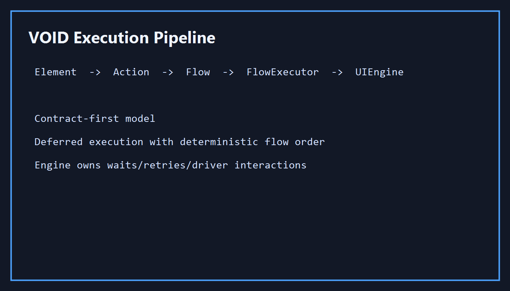
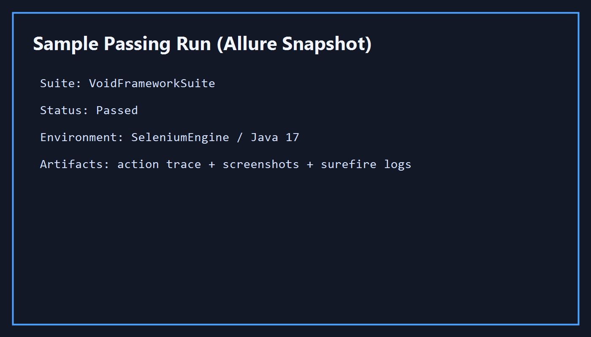

# VOID — Virtual Object Interaction Domain

An interaction runtime for modeling and executing interaction workflows.
Currently configured for UI automation.

**Element → Action → Flow → FlowExecutor → UIEngine**

VOID separates interaction modeling from execution.
Elements emit actions. Actions compose flows. Flows are executed by the VOID Runtime through interchangeable engines that own waits, retries, locator resolution, synchronization, and native automation concerns.

Test code describes intent.
The runtime handles execution.

Selenium today. Playwright-ready by contract. Engine-agnostic by design.

[](https://github.com/Aryan-Vashishth/void/actions/workflows/ci.yml)
[](https://github.com/Aryan-Vashishth/void/actions/workflows/demo.yml)


---

## Architecture

<!--  -->

## Run the demo

```bash
git clone https://github.com/Aryan-Vashishth/void.git
cd void
mvn -B test -Dtest=VoidDemo
```

Expected output:

```text
[VOID] Engine: SeleniumEngine
[VOID] Flow start: login
[VOID] -> type(USERNAME_INPUT, "tomsmith")
[VOID] -> type(PASSWORD_INPUT, "******")
[VOID] -> click(LOGIN_BUTTON)
[VOID] Flow end: login (3 actions, 1.2s)
```
<!--
Sample report snapshot:



[View sample Allure report](docs/images/allure-report-sample.png)
-->
---

## TL;DR

```java
import core.flow.Flow;
import core.runtime.VOID;
import tests.demo.pages.DemoLoginPage;

VOID app = VOID.start();

app.navigateTo("https://the-internet.herokuapp.com/login");

app.run(Flow.of(
    DemoLoginPage.Credentials.USERNAME_INPUT.type("tomsmith"),
    DemoLoginPage.Credentials.PASSWORD_INPUT.type("SuperSecretPassword!"),
    DemoLoginPage.Button.LOGIN_BUTTON.click()
));

assertTrue(app.getCurrentUrl().contains("/secure"));

app.shutdown();
```

---

## Single Execution Path

VOID enforces one execution path:

```text
Tests → VOID (session) → FlowExecutor → UIEngine
```

The full expansion:

```text
Element → Action → Flow → VOID.run() → FlowExecutor → UIEngine
```

There is no alternative path for new code.
No direct WebDriver calls.
No bypassing the system.

If you bypass this path, you are outside the system.

This constraint is what makes behavior predictable and debuggable.

---

## Mental Model

| Layer | Responsibility | What it should do | What it should not do |
|---|---|---|---|
| `VOID` | session object | navigate, run flows, shutdown | click, type, resolve |
| `Element` | typed UI contract | declare roles and locator keys | execute browser actions |
| `Action` | deferred intent | describe what should happen | touch WebDriver / `By` |
| `Flow` | composition | group actions into a workflow | execute anything |
| `FlowExecutor` | internal executor | execute actions in order | be constructed by test code |
| `UIEngine` | browser executor | waits, retries, scroll, click, type, screenshot | act as test API |

```text
Element → Action → Flow → VOID.run() → FlowExecutor → UIEngine
```

Test code interacts with `VOID`, `Flow`, `Action`, and `Element`.
Everything else is internal.

---

## What VOID is / is not

### VOID is
- a structured automation system
- enum-based element modeling with capability interfaces
- deferred execution through actions and flows
- execution through an engine that owns waits, retries, and browser interaction
- externalized, role-based locator resolution

### VOID is not
- a Selenium-only or Playwright-only wrapper API for direct test code
- a Page Object Model framework centered around mutable page classes
- a place to call `By.xpath(...)`, `WebDriver`, or raw DOM helpers from tests

---

## Elements

Elements are defined as enums implementing capability interfaces.
The capability determines which kind of `Action` an element can emit.

Real example from `tests.demo.pages.DemoLoginPage`:

```java
public interface DemoLoginPage {

    String LOCATOR_FILE = "demo-login-elements.json";

    enum Credentials implements Typeable {
        USERNAME_INPUT("USERNAME_INPUT"),
        PASSWORD_INPUT("PASSWORD_INPUT");

        private final String key;
        Credentials(String k) { this.key = k; }

        @Override public String getInputLocator()     { return key; }
        @Override public String getExternalFileName() { return LOCATOR_FILE; }
        @Override public Object[] getArgs()           { return new Object[0]; }
    }

    enum Button implements Clickable {
        LOGIN_BUTTON("LOGIN_BUTTON", "Login");

        private final String key;
        private final String label;
        Button(String k, String l) { this.key = k; this.label = l; }

        @Override public String getTriggerLocator()   { return key; }
        @Override public String getExternalFileName() { return LOCATOR_FILE; }
        @Override public Object[] getArgs()           { return new Object[]{label}; }
    }
}
```

Common capability interfaces live under:
- `elements/api/capability/Clickable.java`
- `elements/api/capability/Typeable.java`
- `elements/api/capability/Selectable.java`
- `elements/api/capability/ReadOnly.java`
- `elements/api/capability/Hoverable.java`

---

## Actions

Elements do not execute.
They emit `Action`.

Examples from the current API:

```java
DemoLoginPage.Button.LOGIN_BUTTON.click();
DemoLoginPage.Credentials.USERNAME_INPUT.type("tomsmith");
DemoLoginPage.Credentials.PASSWORD_INPUT.typeAndPress("secret", "ENTER");
```

Key idea:
- `Action` = deferred intent
- no browser work happens when the action is created
- execution happens later when `FlowExecutor` calls `perform(UIEngine)`

---

## Flow + FlowExecutor

`Flow` composes actions. `VOID.run()` executes them — you never need to construct `FlowExecutor` in test code.

```java
import core.flow.Flow;
import core.runtime.VOID;
import tests.demo.pages.DemoLoginPage;

VOID app = VOID.start();

app.navigateTo("https://the-internet.herokuapp.com/login");

Flow login = Flow.of(
    DemoLoginPage.Credentials.USERNAME_INPUT.type("tomsmith"),
    DemoLoginPage.Credentials.PASSWORD_INPUT.type("SuperSecretPassword!"),
    DemoLoginPage.Button.LOGIN_BUTTON.click()
);

app.run(login);
```

Single action execution also works:

```java
app.run(DemoLoginPage.Button.LOGIN_BUTTON.click());
```

> Legacy note: `core.interactions.Interactions` still exists for compatibility, but it is deprecated and should not be the primary API for new code.

---

## Hooks

Hooks are applied at the action layer via directional fluent APIs:

- `Action.before(BeforeActionHandler...)`
- `Action.after(AfterActionHandler...)`

Hooks wrap actions. They do not change execution — they add behavior around it.
They operate on the same action pipeline, not outside it.
They are part of execution, not a separate layer.

```java
import core.flow.Flow;
import core.interactions.hooks.After;
import core.interactions.hooks.Before;

Flow login = Flow.of(
    DemoLoginPage.Credentials.USERNAME_INPUT.type("tomsmith")
        .before(Before.CLEAR_FIELD, Before.HIGHLIGHT_ELEMENT)
        .after(After.HIGHLIGHT_ELEMENT),
    DemoLoginPage.Credentials.PASSWORD_INPUT.type("SuperSecretPassword!")
        .before(Before.CLEAR_FIELD)
        .after(After.HIGHLIGHT_ELEMENT),
    DemoLoginPage.Button.LOGIN_BUTTON.click()
        .before(Before.WAIT_FOR_ELEMENT_CLICKABLE)
        .after(After.HIGHLIGHT_ELEMENT)
);
```

Current codebase supports:
- action-level hook composition via `.before(...).after(...)`
- hook execution through the normal action/flow pipeline

FlowExecutor-level hooks are not implemented as a separate public API in the current codebase.

---

## UIEngine

`UIEngine` is where browser complexity lives.

It owns behavior such as:
- waits
- retries
- scroll into view
- click/type execution
- screenshots
- hover/highlight
- native-driver integration

You don’t deal with that complexity.

Test code should think in terms of:
- sessions (`VOID`)
- elements
- actions
- flows

Not:
- `WebDriver`
- `By`
- `FlowExecutor` construction
- raw engine calls for ordinary UI interactions

---

## Locators

Locators are externalized and role-based.

Tests never use `By`.
Elements declare logical locator roles (`TRIGGER`, `INPUT`, `TEXT`, etc.).
Locator values live in external `.json` / `.properties` files.
Resolution happens inside the framework, not in test code.

Example from the demo page:
- `DemoLoginPage.Credentials.USERNAME_INPUT` → role `INPUT`
- `DemoLoginPage.Button.LOGIN_BUTTON` → role `TRIGGER`
- locator file: `demo-login-elements.json`

### Locator resolution pipeline (DemoLoginPage)

Using `tests/demo/pages/DemoLoginPage.java` as reference:

1. `DemoLoginPage.Button.LOGIN_BUTTON.click()` emits a deferred `Action`.
2. At execution time, the action calls `engine.resolve(element, ElementRole.TRIGGER)`.
3. `DemoLoginPage.Button.LOGIN_BUTTON.getTriggerLocator()` returns key `LOGIN_BUTTON`.
4. `DemoLoginPage.Button.LOGIN_BUTTON.getExternalFileName()` returns `demo-login-elements.json`.
5. Resolver reads the locator template/value, applies `getArgs()` (`"Login"` for `LOGIN_BUTTON`), and builds a `LocatorDescriptor`.
6. `UIEngine` executes the action (`click`, `type`, etc.) from that resolved descriptor.

This keeps test code free of `By`, hardcoded locator strings, and engine-specific selector APIs.

---

## Project Structure

```text
void-framework/
├── src/main/java/
│   ├── core/
│   │   ├── actions/                # Action contract + action factories
│   │   ├── flow/                   # Flow composition
│   │   ├── executor/               # FlowExecutor
│   │   ├── engine/                 # UIEngine + engine implementations
│   │   ├── runtime/                # VOID facade / startup
│   │   ├── interactions/hooks/     # Action hook library (legacy package location)
│   │   ├── resolvers/locator/      # Locator resolution infrastructure
│   │   └── driver/                 # Driver lifecycle and bootstrap support
│   ├── elements/
│   │   ├── api/                    # Element contracts
│   │   └── meta/                   # ElementRole and metadata
│   └── tests/demo/
│       ├── VoidDemo.java           # Current Action/Flow/FlowExecutor demo
│       └── pages/                  # Demo element enums
├── src/main/resources/
│   └── locators/                   # External locator definitions
└── docs/
    ├── architecture/              # Architecture docs
    └── audits/                    # Audit reports
```

Legacy compatibility remains under `core/interactions/`, but it is not the primary model.

---

## Current setup path

The execution model is in place and the session façade is wired.

A typical test looks like this:

```java
VOID app = VOID.start();

app.navigateTo("https://the-internet.herokuapp.com/login");

app.run(loginFlow);

assertTrue(app.getCurrentUrl().contains("/secure"));

app.shutdown();
```

Multi-session tests are fully supported:

```java
VOID admin    = VOID.start();
VOID customer = VOID.start();

admin.navigateTo(ADMIN_URL);
admin.run(adminLoginFlow);

customer.navigateTo(APP_URL);
customer.run(customerLoginFlow);

admin.run(createUserFlow);

customer.run(searchUserFlow);

admin.run(approveFlow);

customer.run(verifyApprovalFlow);

admin.shutdown();    // does NOT affect customer session
customer.shutdown();
```

Each `VOID` instance is its own isolated session.
`admin.shutdown()` only quits the admin browser.

---

## Minimal example with the demo page

```java
import core.flow.Flow;
import core.runtime.VOID;
import tests.demo.pages.DemoLoginPage;

public class Example {
    public static void main(String[] args) {
        VOID app = VOID.start();

        try {
            app.navigateTo("https://the-internet.herokuapp.com/login");

            app.run(Flow.of(
                DemoLoginPage.Credentials.USERNAME_INPUT.type("tomsmith"),
                DemoLoginPage.Credentials.PASSWORD_INPUT.type("SuperSecretPassword!"),
                DemoLoginPage.Button.LOGIN_BUTTON.click()
            ));
        } finally {
            app.shutdown();
        }
    }
}
```

This mirrors `src/main/java/tests/demo/VoidDemo.java`.

---

## Documentation

| Document | Description |
|----------|-------------|
| `docs/architecture/quick-start.md` | Getting started walkthrough |
| `docs/architecture/system-overview.md` | Architecture and execution flow |
| `docs/architecture/configuration-reference.md` | Config keys and behavior |
| `docs/architecture/logging-reference.md` | Log channels, folder layout, and trace depth |
| `docs/architecture/locator-resolution.md` | Locator roles and resolution pipeline |
| `docs/architecture/hooks-pipeline.md` | Hook behavior and composition |
| `docs/audits/architecture-audit-2026-05.md` | Architecture audit — coupling, leakage, engine-swap readiness |
| `docs/audits/facade-boundary-audit-2026-05.md` | Façade boundary audit — session abstraction gaps and fixes |
| `docs/decisions/accepted/` | Architecture Decision Records (ADR-001 → ADR-011) |
| `CHANGELOG.md` | Version history |
| `CONTRIBUTING.md` | Contribution guide |

---

## License

MIT License © 2025–2026

