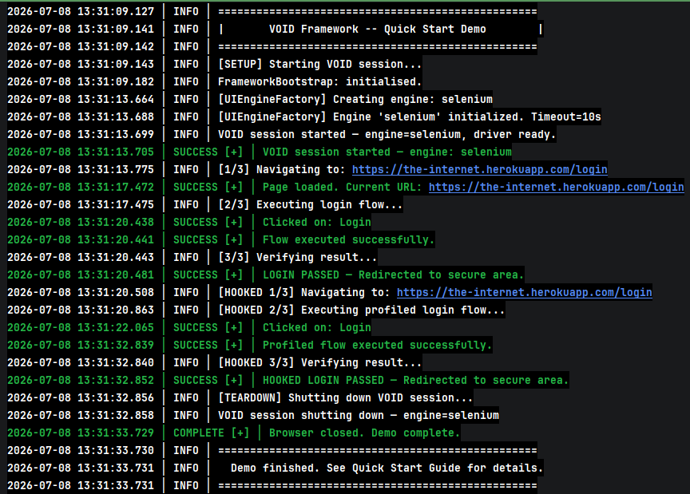

# VOID (Virtual Object Interaction-Domain) Runtime System

An interaction runtime for modeling and executing interaction workflows.
Currently configured for UI automation.

**Element → Action → Flow → FlowExecutor → UIEngine**

VOID separates interaction modeling from execution.
Elements emit actions. Actions compose flows. Flows are executed by the VOID Runtime through interchangeable engines that own waits, retries, locator resolution, synchronization, and native automation concerns.

Test code describes intent.
The runtime handles execution.

Selenium today. Playwright-ready by contract. Engine-agnostic by design.

[](https://github.com/Aryan-Vashishth/void/actions/workflows/ci.yml)
[](https://github.com/Aryan-Vashishth/void/actions/workflows/demo.yml)


---

## Run the demo

```bash
git clone https://github.com/Aryan-Vashishth/void.git
cd void
mvn -B test -Dtest=VoidDemo
```

Expected output:



---

## TL;DR

```java
import core.flow.Flow;
import core.runtime.VOID;
import tests.demo.pages.DemoLoginPage;

VOID app = VOID.builder().start();

app.navigateTo("https://the-internet.herokuapp.com/login");

app.run(Flow.of(
    DemoLoginPage.Credentials.USERNAME.type("tomsmith"),
    DemoLoginPage.Credentials.PASSWORD.type("SuperSecretPassword!"),
    DemoLoginPage.Button.LOGIN_BUTTON.click()
));

assertTrue(app.getCurrentUrl().contains("/secure"));

app.shutdown();
```

---

## Single Execution Path

VOID enforces one execution path:

```text
Tests → VOID (session) → FlowExecutor → UIEngine
```

The full expansion:

```text
Element → Action → Flow → VOID.run() → FlowExecutor → UIEngine
```

There is no alternative path for new code.
No direct WebDriver calls.
No bypassing the system.

If you bypass this path, you are outside the system.

This constraint is what makes behavior predictable and debuggable.

---

## Mental Model

| Layer | Responsibility | What it should do | What it should not do |
|---|---|---|---|
| `VOID` | session object | navigate, run flows, shutdown | click, type, resolve |
| `Element` | typed UI contract | declare roles and locator keys | execute browser actions |
| `Action` | deferred intent | describe what should happen | touch WebDriver / `By` |
| `Flow` | composition | group actions into a workflow | execute anything |
| `FlowExecutor` | internal executor | execute actions in order | be constructed by test code |
| `UIEngine` | browser executor | waits, retries, scroll, click, type, screenshot | act as test API |

```text
Element → Action → Flow → VOID.run() → FlowExecutor → UIEngine
```

Test code interacts with `VOID`, `Flow`, `Action`, and `Element`.
Everything else is internal.

---

## What VOID is / is not

### VOID is
- a structured automation system
- enum-based element modeling with capability interfaces
- deferred execution through actions and flows
- execution through an engine that owns waits, retries, and browser interaction
- externalized, role-based locator resolution

### VOID is not
- a Selenium-only or Playwright-only wrapper API for direct test code
- a Page Object Model framework centered around mutable page classes
- a place to call `By.xpath(...)`, `WebDriver`, or raw DOM helpers from tests

---

## Elements

Elements are defined as enums implementing capability interfaces.
The capability determines which kind of `Action` an element can emit.

Real example from `tests.demo.pages.DemoLoginPage`:

```java
public interface DemoLoginPage {

    // LocatorFamily: all constants share one template key; getArgs() supplies
    // the runtime argument. Locator file: locators.properties (resolved by convention).
    enum Credentials implements Typeable, LocatorFamily {
        USERNAME,
        PASSWORD;

        @Override
        public Object[] getArgs() {
            return new Object[]{name().toLowerCase()};
        }
    }

    enum Button implements Clickable {
        LOGIN_BUTTON
    }

    enum Labels implements ReadOnly {
        SUCCESS_MESSAGE
    }
}
```

For plain elements (no `LocatorFamily`):

- Locator keys default to `PageClass.EnumClass.CONSTANT.ROLE` (e.g. `DemoLoginPage.Button.LOGIN_BUTTON.TRIGGER`).
- Locator file defaults to the conventional `.json` path derived from the FQCN (e.g. `tests/demo/pages/DemoLoginPage/locators.json`).
- Display text defaults to a word-transformed constant name (`LOGIN_BUTTON` → `"Login Button"`).
- `getArgs()` defaults to no args.

For `LocatorFamily` elements (like `Credentials` above):

- All constants in the enum share one template key (`DemoLoginPage.Credentials`).
- Locator file resolves to a `.properties` path (e.g. `tests/demo/pages/DemoLoginPage/locators.properties`).
- `getArgs()` supplies the per-constant substitution argument for the `%s` template.

All defaults are overridable. `getExternalFileName()` lets an element point to a named file instead of the convention.

Common capability interfaces live under `elements/api/capability/`:
`Clickable`, `Typeable`, `Selectable`, `ReadOnly`, `Hoverable`, `Checkable`, `Uploadable`, `Table`, `EditableTable`, `Listable`, `MultiSelectable`, `SearchField`, `Searchable`, `SearchableDropdown`.

---

## Locator Families

For groups of elements that share a single XPath template (e.g. a navigation menu where every item uses the same `//a[text()='%s']` pattern), VOID provides three progressively expressive patterns:

### `LocatorFamily` — labels auto-derived from constant name

```java
public interface ReportsPage {

    enum Nav implements Clickable, LocatorFamily {
        OVERVIEW, KPI_SUMMARY, VENDOR_PERFORMANCE;
        // Template in locators.properties: //li[@data-nav='%s']
        // Args: OVERVIEW→"Overview", KPI_SUMMARY→"Kpi Summary", ...
    }
}
```

### `AdvancedLocatorFamily` — mix auto-derived and explicit labels

Use when most constants auto-derive cleanly but a few need custom values (acronyms, punctuation, slashes):

```java
enum Filters implements Clickable, AdvancedLocatorFamily {
    COUNTRY,                                // auto: "Country"
    PROGRAM_NAME,                           // auto: "Program Name"
    HQ_STATE_PROVINCE("HQ State/Province"), // explicit: slash
    CRM("CRM");                             // explicit: all-caps

    private final String semanticValue;
    Filters()         { this.semanticValue = null; }
    Filters(String v) { this.semanticValue = v; }

    @Override public String getSemanticValue() { return semanticValue; }
}
```

### `SwitchLocatorFamily` — all explicit, compiler-enforced exhaustiveness

Use when all constants require custom values and a compile-time guarantee that every new constant gets a mapping:

```java
enum Sections implements Clickable, SwitchLocatorFamily {
    OVERVIEW, KPI_SUMMARY, VENDOR_PERFORMANCE, YTD_ANALYSIS;

    @Override
    public String getSemanticValue() {
        return switch (this) {
            case OVERVIEW           -> "Overview";
            case KPI_SUMMARY        -> "KPI Summary";
            case VENDOR_PERFORMANCE -> "Vendor Performance";
            case YTD_ANALYSIS       -> "YTD Analysis";
        };
    }
}
```

Adding a new constant without updating the switch is a compile error.

---

## Actions

Elements do not execute.
They emit `Action`.

Examples from the current API:

```java
DemoLoginPage.Button.LOGIN_BUTTON.click();
DemoLoginPage.Credentials.USERNAME.type("tomsmith");
DemoLoginPage.Credentials.PASSWORD.typeAndPress("secret", "ENTER");
```

Key idea:
- `Action` = deferred intent
- no browser work happens when the action is created
- execution happens later when `FlowExecutor` calls `perform(UIEngine)`

---

## Flow + FlowExecutor

`Flow` composes actions. `VOID.run()` executes them — you never need to construct `FlowExecutor` in test code.

```java
import core.flow.Flow;
import core.runtime.VOID;
import tests.demo.pages.DemoLoginPage;

VOID app = VOID.builder().start();

app.navigateTo("https://the-internet.herokuapp.com/login");

Flow login = Flow.of(
    DemoLoginPage.Credentials.USERNAME.type("tomsmith"),
    DemoLoginPage.Credentials.PASSWORD.type("SuperSecretPassword!"),
    DemoLoginPage.Button.LOGIN_BUTTON.click()
);

app.run(login);
```

Single action execution also works:

```java
app.run(DemoLoginPage.Button.LOGIN_BUTTON.click());
```

> Legacy note: `core.interactions.Interactions` still exists for compatibility, but it is deprecated and should not be the primary API for new code.

---

## Hooks

Hooks are applied at the action layer via directional fluent APIs:

- `Action.before(BeforeActionHandler...)`
- `Action.after(AfterActionHandler...)`

Hooks wrap actions. They do not change execution — they add behavior around it.
They are part of the same pipeline, not a separate layer.

### Profiles — preferred approach

`.safely()` and `.reliable()` apply the correct pre-built hook set for the action's
capability family with no manual wiring:

```java
app.run(Flow.of(
    DemoLoginPage.Credentials.USERNAME.type("tomsmith").safely(),
    DemoLoginPage.Credentials.PASSWORD.type("SuperSecretPassword!").safely(),
    DemoLoginPage.Button.LOGIN_BUTTON.click().safely()
));
```

`reliable()` extends safe with loader waits before and after — use it for Angular or
spinner-heavy pages where timing is tight.

### Manual hook composition

Use `.before(...)` / `.after(...)` with constants from `core.interactions.hooks.Before`
and `After` when you need explicit control:

```java
import core.interactions.hooks.After;
import core.interactions.hooks.Before;

Flow login = Flow.of(
    DemoLoginPage.Credentials.USERNAME.type("tomsmith")
        .before(Before.CLEAR_FIELD)
        .after(After.HIGHLIGHT_ELEMENT),
    DemoLoginPage.Credentials.PASSWORD.type("SuperSecretPassword!")
        .before(Before.CLEAR_FIELD)
        .after(After.HIGHLIGHT_ELEMENT),
    DemoLoginPage.Button.LOGIN_BUTTON.click()
        .before(Before.WAIT_FOR_ELEMENT_CLICKABLE)
        .after(After.HIGHLIGHT_ELEMENT)
);
```

### Writing your own hook library

For app-specific hooks used across multiple tests, create a constants-holder class
following the same pattern as `core.interactions.hooks.After` and `Before`:

```java
package tests.your.hooks;

import core.interactions.hooks.AfterActionHandler;
import core.interactions.hooks.BeforeActionHandler;
import elements.meta.ElementRole;
import java.time.Duration;
import static core.logging.CustomLogger.debug;

public final class AppHooks {

    private AppHooks() {}

    /** Wait for the app's loading overlay to disappear after an action. */
    public static final AfterActionHandler WAIT_FOR_PAGE_LOAD = (engine, descriptor) -> {
        engine.waitForInvisible(
                engine.resolve(AppOverlays.SPINNER, ElementRole.PRIMARY),
                Duration.ofSeconds(15));
        debug.log("[HOOK] Page load complete.");
    };

    /** Dismiss any visible cookie banner before interacting. */
    public static final BeforeActionHandler DISMISS_COOKIE_BANNER = (engine, descriptor) -> {
        engine.click(engine.resolve(AppOverlays.COOKIE_BANNER, ElementRole.PRIMARY));
    };
}
```

Key rules:
- Use `AfterActionHandler` for after-hooks and `BeforeActionHandler` for before-hooks — not the raw `ActionHandler` supertype — so callers know which slot the constant belongs in.
- Use `engine` methods only. Never reference `WebDriver` or `WebElement`.
- One hook, one concern. Compose multiple hooks in `.after(hookA, hookB)`.

Usage — layer on top of a profile or compose freely with built-in hooks:

```java
// Layer a custom after-hook on top of .safely()
DemoLoginPage.Button.LOGIN_BUTTON.click()
        .safely()
        .after(AppHooks.WAIT_FOR_PAGE_LOAD)

// Full manual composition
MyPage.SUBMIT_BUTTON.click()
        .before(AppHooks.DISMISS_COOKIE_BANNER, Before.WAIT_FOR_ELEMENT_CLICKABLE)
        .after(AppHooks.WAIT_FOR_PAGE_LOAD, After.HIGHLIGHT_ELEMENT)
```

For a working example, see `tests/demo/hooks/DemoHooks.java`.
Full hook reference: [`docs/architecture/hooks-pipeline.md`](docs/architecture/hooks-pipeline.md).

---

## UIEngine

`UIEngine` is where browser complexity lives.

It owns behavior such as:
- waits
- retries
- scroll into view
- click/type execution
- screenshots
- hover/highlight
- native-driver integration

You don’t deal with that complexity.

Test code should think in terms of:
- sessions (`VOID`)
- elements
- actions
- flows

Not:
- `WebDriver`
- `By`
- `FlowExecutor` construction
- raw engine calls for ordinary UI interactions

---

## Locators

Locators are externalized and role-based.

Tests never use `By`.
Elements declare logical locator roles (`TRIGGER`, `INPUT`, `TEXT`, etc.).
Locator values live in external `.json` / `.properties` files.
Resolution happens inside the framework, not in test code.

Example from the demo page:
- `DemoLoginPage.Credentials.USERNAME` → LocatorFamily element, role `INPUT`, locator file: `tests/demo/pages/DemoLoginPage/locators.properties`
- `DemoLoginPage.Button.LOGIN_BUTTON` → plain element, role `TRIGGER`, locator file: `tests/demo/pages/DemoLoginPage/locators.json`

### Locator resolution pipeline (DemoLoginPage)

Using `tests/demo/pages/DemoLoginPage.java` as reference:

1. `DemoLoginPage.Button.LOGIN_BUTTON.click()` emits a deferred `Action`.
2. At execution time, the action calls `engine.resolve(element, ElementRole.TRIGGER)`.
3. `getPrimaryLocator()` returns the qualified key `DemoLoginPage.Button.LOGIN_BUTTON.TRIGGER`.
4. `getExternalFileName()` returns `null` → falls back to the conventional classpath path.
5. Convention maps the element's declaring page class FQCN to `tests/demo/pages/DemoLoginPage/locators.json`.
6. Resolver reads `{ "TRIGGER": "//button[@type='submit']" }` and builds a `LocatorDescriptor`.
7. `UIEngine` executes the action (`click`, `type`, etc.) from that descriptor.

This keeps test code free of `By`, hardcoded locator strings, and engine-specific selector APIs.

### Generate locators with `--sync`

```bash
mvn compile -q && mvn exec:java \
  -Dexec.mainClass=core.resolvers.locator.json.JsonMigratorCli \
  -Dexec.args="--sync tests.demo.pages.DemoLoginPage"
```

This creates a `locators.properties` template. Fill in the XPath values, then re-run to write `locators.json`.
Claude Code slash commands `/sync-locators`, `/print-locators`, and `/write-locators` wrap this for in-IDE use.

---

## Project Structure

```text
void-framework/
├── src/main/java/
│   ├── core/
│   │   ├── actions/                # Action contract + action factories
│   │   ├── flow/                   # Flow composition
│   │   ├── executor/               # FlowExecutor
│   │   ├── engine/                 # UIEngine + engine implementations
│   │   ├── runtime/                # VOID facade / startup
│   │   ├── interactions/hooks/     # Action hook library (legacy package location)
│   │   ├── resolvers/locator/      # Locator resolution infrastructure
│   │   └── driver/                 # Driver lifecycle and bootstrap support
│   ├── elements/
│   │   ├── api/                    # Element contracts
│   │   └── meta/                   # ElementRole and metadata
│   └── tests/demo/
│       ├── VoidDemo.java           # Current Action/Flow/FlowExecutor demo
│       ├── pages/                  # Demo element enums
│       └── hooks/                  # DemoHooks — named AfterActionHandler constants
├── src/main/resources/
│   ├── locators/                   # Legacy named locator files (.properties / .json)
│   └── tests/                      # Conventional locator repository (auto-path by FQCN)
├── logs/                       # Runtime trace archive — gitignored, generated each run
│   └── YYYY-MM-DD/
│       ├── debug-trace/        # Full caller-chain traces (DEBUG level)
│       ├── partial-trace/      # Action-level traces without caller chain
│       └── full-trace/         # All output, no ANSI
└── docs/
    ├── architecture/              # Architecture docs
    └── audits/                    # Audit reports
```

Legacy compatibility remains under `core/interactions/`, but it is not the primary model.

---

## Current setup path

The execution model is in place and the session façade is wired.

A typical test looks like this:

```java
VOID app = VOID.builder().start();

app.navigateTo("https://the-internet.herokuapp.com/login");

app.run(loginFlow);

assertTrue(app.getCurrentUrl().contains("/secure"));

app.shutdown();
```

Multi-session tests are fully supported:

```java
VOID admin    = VOID.builder().start();
VOID customer = VOID.builder().start();

admin.navigateTo(ADMIN_URL);
admin.run(adminLoginFlow);

customer.navigateTo(APP_URL);
customer.run(customerLoginFlow);

admin.run(createUserFlow);

customer.run(searchUserFlow);

admin.run(approveFlow);

customer.run(verifyApprovalFlow);

admin.shutdown();    // does NOT affect customer session
customer.shutdown();
```

Each `VOID` instance is its own isolated session.
`admin.shutdown()` only quits the admin browser.

---

## Minimal example with the demo page

```java
import core.flow.Flow;
import core.runtime.VOID;
import tests.demo.pages.DemoLoginPage;

public class Example {
    public static void main(String[] args) {
        VOID app = VOID.builder().start();

        try {
            app.navigateTo("https://the-internet.herokuapp.com/login");

            app.run(Flow.of(
                DemoLoginPage.Credentials.USERNAME.type("tomsmith"),
                DemoLoginPage.Credentials.PASSWORD.type("SuperSecretPassword!"),
                DemoLoginPage.Button.LOGIN_BUTTON.click()
            ));
        } finally {
            app.shutdown();
        }
    }
}
```

This mirrors `src/main/java/tests/demo/VoidDemo.java`.

---

## Documentation

| Document | Description |
|----------|-------------|
| `docs/architecture/quick-start.md` | Getting started walkthrough |
| `docs/architecture/system-overview.md` | Architecture and execution flow |
| `docs/architecture/actions.md` | Action layer — full hierarchy, profiles, operationLabel, extension guide |
| `docs/architecture/configuration-reference.md` | Config keys and behavior |
| `docs/architecture/logging-reference.md` | Log channels, folder layout, and trace depth |
| `docs/architecture/locator-resolution.md` | Locator roles and resolution pipeline |
| `docs/architecture/hooks-pipeline.md` | Hook behavior and composition |
| `docs/audits/architecture-audit-2026-05.md` | Architecture audit — coupling, leakage, engine-swap readiness |
| `docs/audits/facade-boundary-audit-2026-05.md` | Façade boundary audit — session abstraction gaps and fixes |
| `docs/decisions/accepted/` | Architecture Decision Records (ADR-001 → ADR-014) |
| `CHANGELOG.md` | Version history |
| `CONTRIBUTING.md` | Contribution guide |

---

## License

MIT License © 2025–2026

