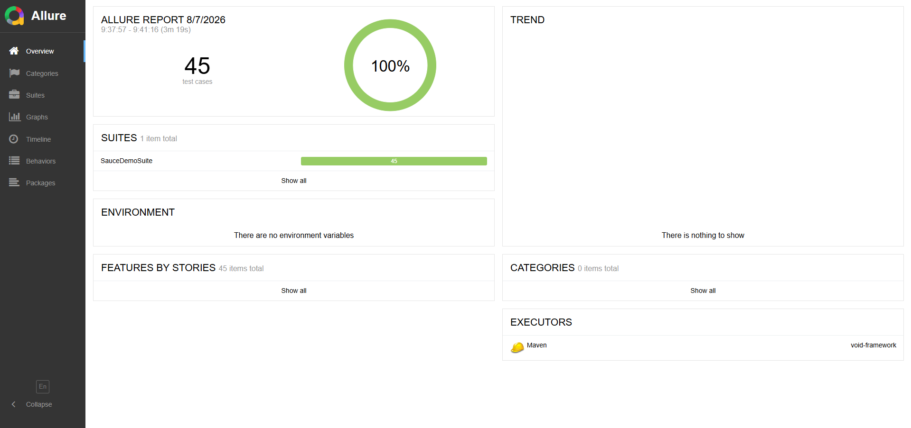
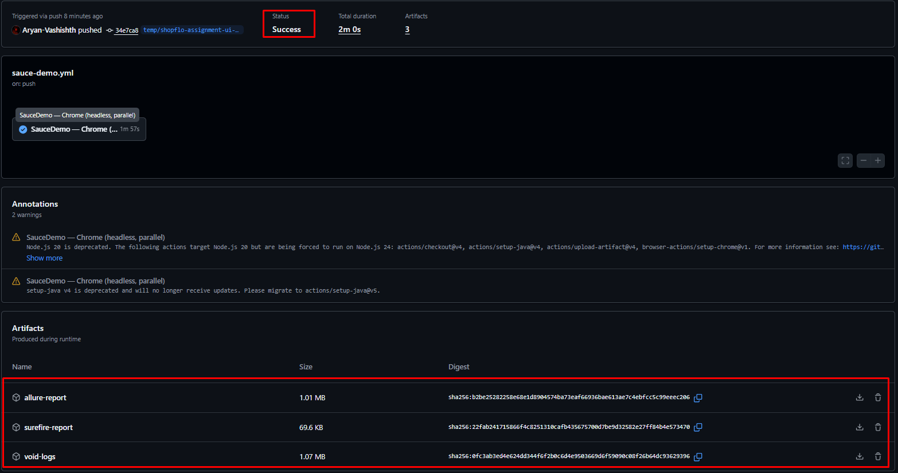

<!-- Badges -->
<p align="center">
  
  
  
  
  <a href="https://github.com/Aryan-Vashishth/void/actions/workflows/sauce-demo.yml"></a>
  
</p>

<h1 align="center">SauceDemo Automation</h1>

Automation suite for [saucedemo.com](https://www.saucedemo.com) built as part of an automation assignment and used to demonstrate the design of the VOID Runtime.

Rather than building on an existing Selenium framework, this project is built on **VOID (Virtual Object Interaction-Domain Runtime)** — an interaction runtime I designed to separate interaction modeling from execution. The SauceDemo suite serves as the reference implementation for the runtime while fulfilling the assignment requirements.

- 46 automated scenarios
- Positive, negative and end-to-end coverage
- Selenium 4 + TestNG
- Parallel execution
- Allure reporting with screenshot-on-failure
- GitHub Actions CI

---

## Example test using the framework

**Conventional Page Object**

```java
loginPage.login("standard_user", "secret_sauce");
```

**VOID**

```java
Flow loginFlow = Flow.of(
    USERNAME.type("standard_user"),
    PASSWORD.type("secret_sauce"),
    LOGIN.click()
);

app.run(loginFlow);
```

Both approaches keep WebDriver out of the test. The difference is architectural. A Page Object method executes immediately. A Flow is a reusable interaction model that can be passed around, composed with other flows, and executed by the runtime whenever needed.

Unlike a page method, `loginFlow` is a value. It can be passed between methods, composed into larger workflows, reused across tests, or executed by any engine implementing the `UIEngine` contract.

---

## Why I built VOID

Most Selenium projects eventually accumulate:

- Wait logic duplicated across page objects and tests
- Page objects that both model the UI and execute browser actions
- Locators commonly coupled to page object implementation, mixing locator management with interaction logic
- Browser execution logic spread across the project rather than owned in one place

I wanted to design a different architecture where tests describe **intent** while a dedicated runtime owns execution. That idea evolved into VOID — an interaction runtime that treats UI automation as one execution domain rather than the system itself.

VOID doesn't replace Selenium, Playwright, Appium, or other automation engines — it provides a unified interaction model that sits above them, separating interaction modeling from execution.

| Conventional Page Objects | VOID |
|---|---|
| Methods execute browser interactions immediately | Elements emit immutable deferred actions |
| Browser logic distributed across page objects | Runtime owns all execution |
| Flows implemented as Java methods | Flows are immutable objects that can be stored, composed, reused, and executed independently |
| Locators commonly coupled to page object implementation | Locators externalized into runtime contracts |
| Selector updates coupled to page object source | Selector updates require no Java changes |
| IDE completion for page methods only | IDE completion for every element, capability, and interaction |
| Runtime errors for wrong interaction types | Compile-time safety via typed capabilities (`Clickable`, `Typeable`, `ReadOnly`) |

### Why this design?

- **Readable tests** -- interactions read like user intent rather than browser commands.
- **Compile-time safety** -- invalid interactions are caught at compile time through typed capability interfaces. Only `Typeable` elements expose `type()`, only `Clickable` elements expose `click()`.
- **Composable flows** -- interaction sequences are immutable objects that can be stored, combined, reused, and executed across different scenarios.
- **Rich IDE support** -- enum-driven page contracts provide discoverable auto-completion for pages, elements, capabilities, and interactions.
- **Externalized locators** -- selector updates are made outside Java source, keeping test and page code unchanged.
- **Runtime-owned execution** -- waits, retries, logging, screenshots, and browser-specific behaviour are implemented once in the runtime rather than duplicated across the project.

---

## Quick start

> Requires JDK 17+, Maven 3.8+, Chrome.

```powershell
git clone https://github.com/Aryan-Vashishth/void.git
cd void
mvn clean test "-Dsurefire.suiteXmlFiles=src/testNgXml/saucedemo.xml"
mvn allure:serve
```

Selenium Manager auto-downloads a matching ChromeDriver -- no manual setup.

> **PowerShell:** quote `-D` arguments to prevent the shell from stripping the flag (`"-Dproperty=value"`).

**IntelliJ:** right-click `src/testNgXml/saucedemo.xml` in the Project view and select **Run**.

**Headless (CI / bash):**

```bash
mvn clean test -Dsurefire.suiteXmlFiles=src/testNgXml/saucedemo.xml \
               -Dheadless=true \
               -Dargs=--no-sandbox,--disable-dev-shm-usage,--disable-gpu,--window-size=1920,1080
```

---

## Test coverage

| Module | Positive | Negative | E2E |
|--------|--------:|---------:|----:|
| Login | 5 | 7 | - |
| Products | 10 | 2 | - |
| Cart | 8 | 2 | 2 |
| Checkout | 6 | 2 | 2 |
| **Total** | **29** | **13** | **4** |

---

## Reporting



Allure generates an interactive HTML report after every run:

- Pass / fail / skip breakdown with duration
- Per-test timeline across parallel threads
- Screenshot attached to every failed test
- Full interaction log per test

```bash
mvn allure:serve
```

---

## CI



Every push and pull request runs the full suite headlessly. Three artifacts are uploaded after each run: `allure-report`, `surefire-report`, and `void-logs`.

---

## Project structure

```
src/
 └── examples/               your web application
      ├── pages/saucedemo/    page contracts — LoginPage, ProductsPage, CartPage, CheckoutPages
      ├── tests/              SauceDemoTest.java — all 46 test methods
      ├── hooks/              named hook constants
      ├── listeners/          screenshot-on-failure wired to Allure
      └── resources/
           └── pages/saucedemo/   locators.json + locators.properties per page
```

---

<details open>
<summary>Architecture</summary>

```
    Test Method
        │
        ▼
    UI Elements     enum constants implementing Clickable / Typeable / ReadOnly
        │
        ▼
      Actions       deferred execution intents — nothing runs yet
        │
        ▼
       Flow         immutable ordered sequence of Actions
        │
        ▼
     Runtime        dispatches to the engine, runs hooks
        │
        ▼
    UI Engine       waits, retries, locator resolution, browser interaction
        │
        ▼
     Selenium       WebDriver execution
```

Elements declare intent. Flows compose actions. The runtime executes.

Full architecture documentation: [`docs/architecture/`](../../../../docs/architecture/)

</details>

<details open>
<summary>Locator system</summary>

Locators live outside Java in external JSON contracts:

```
Update locator value in locators.json
          ↓
Runtime immediately uses the new locator
          ↓
No Java changes. No recompile.
```

Each page class maps to a JSON file by convention — no configuration needed.

</details>

<details open>
<summary>Adding a new page</summary>

1. Create the page interface with nested enums implementing `Clickable`, `Typeable`, or `ReadOnly`.
2. Run `--sync` to generate the locator template.
3. Fill in XPath / CSS values in the generated `.properties` file.
4. Re-run `--sync` to produce `locators.json`.
5. Write test methods in `SauceDemoTest.java`.

</details>

---

## About VOID

VOID is my personal open-source project exploring a different architecture for automation.

Its interaction model is independent of the underlying execution engine, allowing the same programming model to target Selenium today while remaining extensible to Playwright, Appium, REST APIs, and other domains.

---

## Project roadmap

**Current**

- Selenium engine
- Parallel execution with per-thread session isolation
- External JSON locator contracts
- Allure reporting with screenshot-on-failure
- GitHub Actions CI

**Next**

- Playwright engine (no test-code changes required by design)
- LLM-assisted page generation pipeline

**Future**

- Mobile engine (Appium)
- REST API engine
- Desktop engine

---

## Manual test cases

**[View the test case sheet →](https://docs.google.com/spreadsheets/d/1YE2avgbrKymS8T463X9Bkfrhy6aXMyeTp-pLMGpPFNk/edit?usp=sharing)**

Covers all 46 scenarios with Severity, Priority, Steps, Expected Result, Actual Result, and Status columns.

---

*Tests describe intent. The runtime owns execution.*
